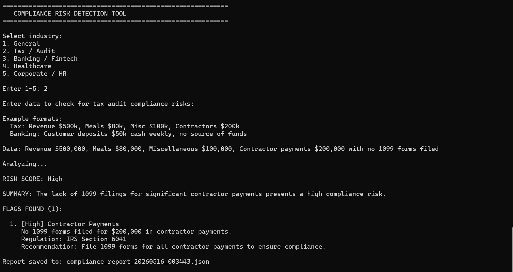

# Compliance Risk Detection Tool

An LLM-powered compliance analysis engine that identifies regulatory risks from business data. Built with Python and GitHub Models (GPT-4o-mini).

## Overview

This tool automates initial risk assessment by analyzing business data against regulatory frameworks across multiple industries. It returns structured output with risk scoring, specific regulation citations, and actionable recommendations.

## Features

| Feature | Description |
|---------|-------------|
| Multi-industry support | Tax/Audit, Banking/Fintech, Healthcare, Corporate/HR, General |
| Risk scoring | Low → Medium → High → Critical |
| Regulation citations | IRS, SEC, HIPAA, SOX, industry-specific |
| Actionable recommendations | Specific steps to address each risk |
| JSON report export | Structured data for audit trails |
| Extensible architecture | Easy to add file upload, web UI, or database for saving history |

## Why I Built This

Compliance is a universal. This project demonstrates:
- LLM integration for real-world business applications
- Prompt engineering for structured, reliable JSON output
- Domain knowledge across regulatory frameworks
- Code organization for easy feature expansion

## Tech Stack

- **Language:** Python 3.12
- **LLM API:** GitHub Models (GPT-4o-mini) 
- **Library:** OpenAI Python SDK
- **Output:** JSON for programmatic use

## How to run

1. `pip install openai`
2. Add token to `compliance_tool.py` 
3. RUN `python compliance_tool.py`

## Demo

